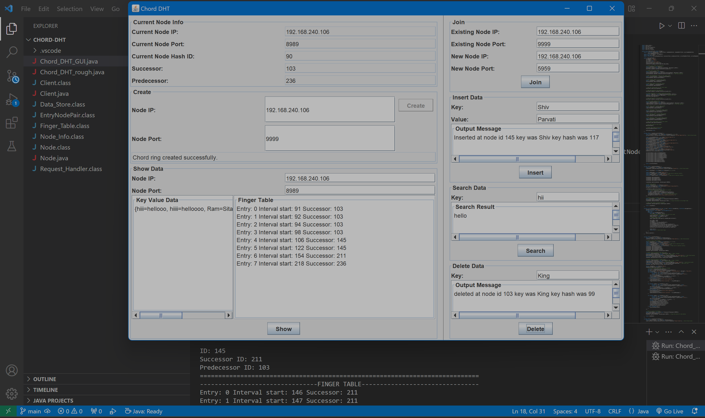

# Chord DHT Implementation

## Overview

This project presents an implementation of the Chord Distributed Hash Table (DHT) protocol in Java. The Chord DHT is a decentralized distributed system that facilitates efficient lookup and storage of key-value pairs over a peer-to-peer network. It is designed to provide scalability, fault tolerance, and fast lookup performance.

## Principles of Consistent Hashing

Chord DHT employs consistent hashing to evenly distribute keys among nodes in the network. Consistent hashing ensures that when a node joins or leaves the network, only a small fraction of keys need to be rehashed, minimizing the impact on the system's overall performance. This principle enables Chord to efficiently handle dynamic changes in the network topology.

## Advantages

- **Scalability**: Chord can accommodate a large number of nodes, allowing the network to scale gracefully as the number of participants increases.
- **Fault Tolerance**: The decentralized nature of Chord ensures resilience against node failures and network partitions, maintaining the availability of data even under adverse conditions.
- **Load Balancing**: Consistent hashing evenly distributes keys among nodes, preventing hotspots and ensuring balanced resource utilization across the network.
- **Fast Lookup**: Chord provides fast key-based lookup operations with O(log N) complexity, where N is the number of nodes in the network. This enables efficient retrieval of data even in large-scale networks.

## Disadvantages

- **Routing Overhead**: Chord requires a logarithmic number of routing hops for key lookup, which can introduce overhead in large networks with high churn rates.
- **Complexity**: Implementing and maintaining a Chord-based system can be complex due to its decentralized architecture and intricate routing mechanisms.

## Features

- **Socket Programming**: Utilizes Java socket programming for communication between nodes in the Chord network.
- **Swing GUI**: Graphical User Interface (GUI) built with Swing for visualization and interaction with the Chord network.
- **System Design**: Incorporates system design principles to ensure modularity, extensibility, and maintainability.
- **Data Structures**: Utilizes data structures such as hash tables and finger tables to implement Chord's routing and lookup algorithms.
- **SHA-256 Hashing**: Employs SHA-256 hashing algorithm to generate unique identifiers for nodes and keys.
- **Connectivity**: Supports connectivity of computers up to 2^m, where m is chosen as 8 in this implementation.

## Usage



1. Clone the repository.
2. Compile and run the Java files.
    - If running `Node.java`, first edit the IP address in the file, then use the following commands:
        ```
        javac Node.java
        ```
        - For creating the first node: `java Node <port number>`
        - For joining other nodes: `java Node <new port number> <existing port number>`
    - For adding data using `Client.java`:
        ```
        javac Client.java
        java Client
        ```
    - For using the GUI, run `Chord_DHT_GUI.java`:
        ```
        javac Chord_DHT_GUI.java
        ```
3. For checking IP address, use `ipconfig` (Windows) or `ifconfig` (Unix-based systems).
4. Choose a port number between 1025 - 65535.

**Warning**: This implementation has been tested only on Windows.

## Contribution

Contributions to this project are welcome! Feel free to submit bug reports, feature requests, or pull requests to enhance the functionality and robustness of the Chord DHT implementation.

